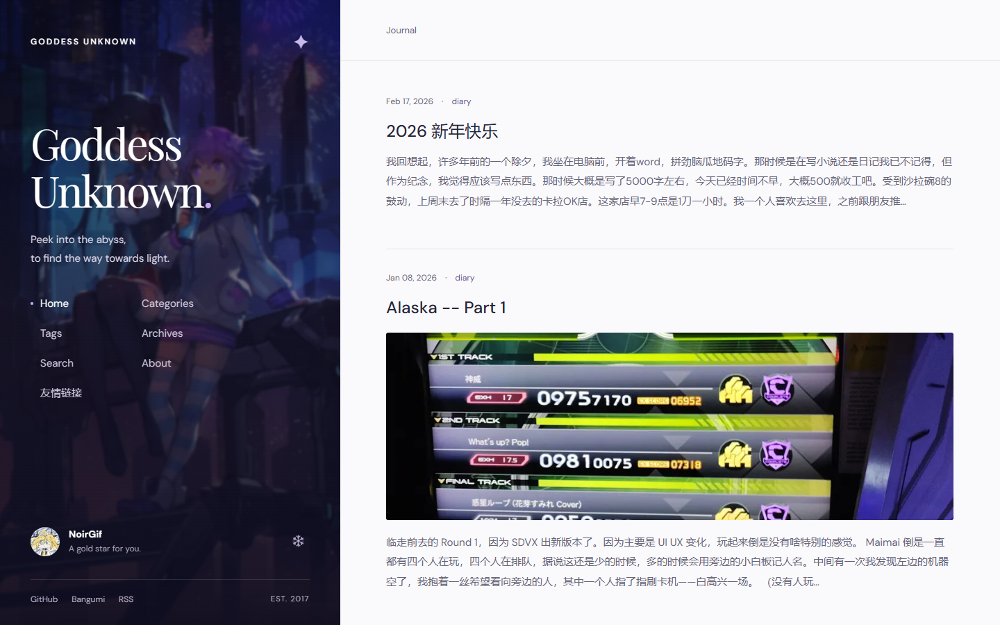
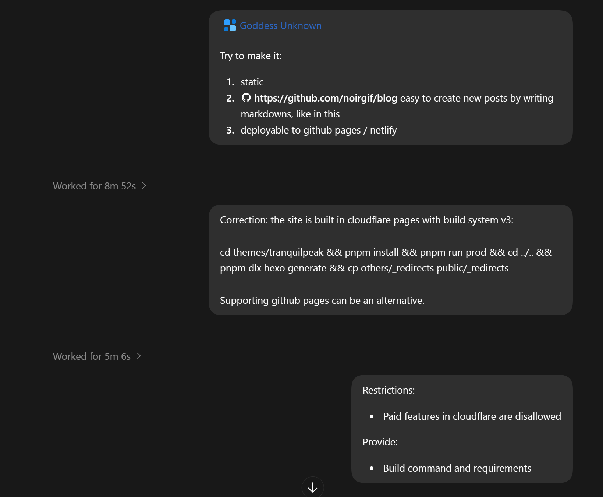
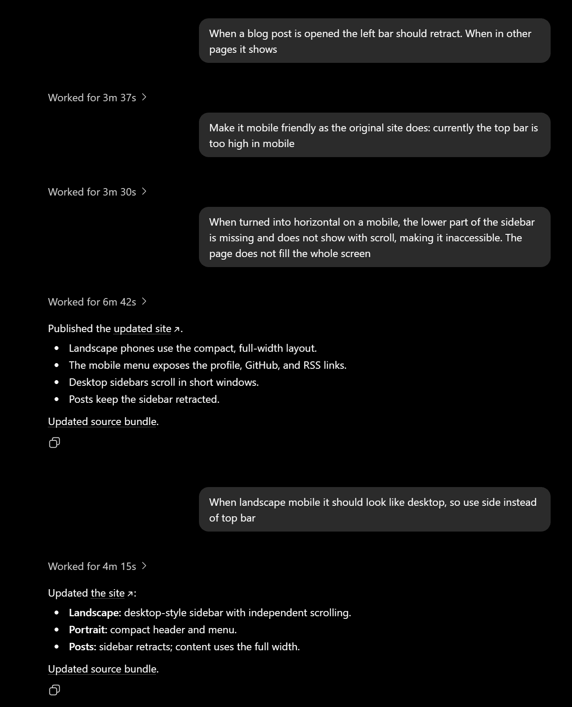
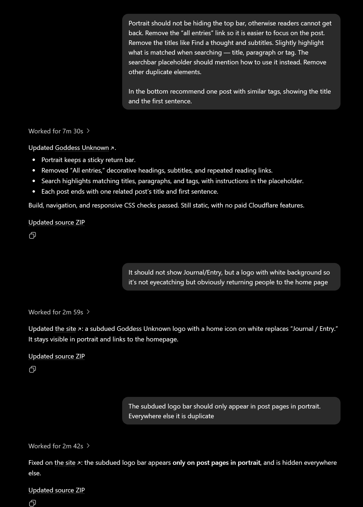
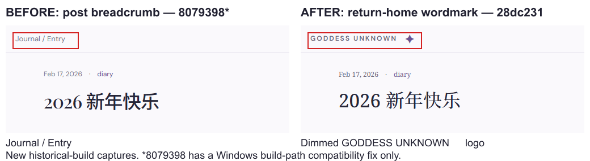
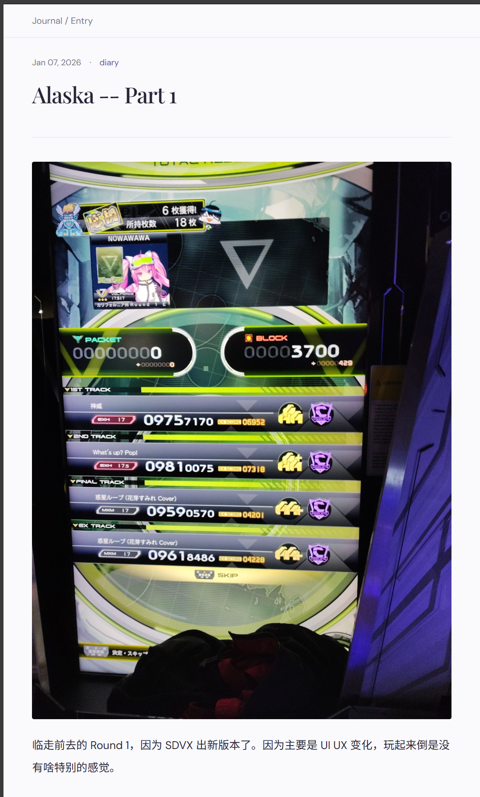
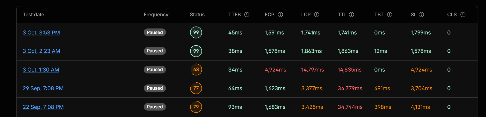
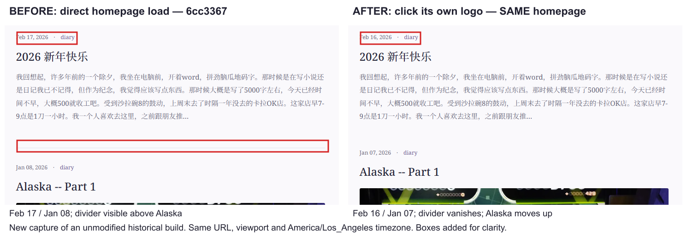
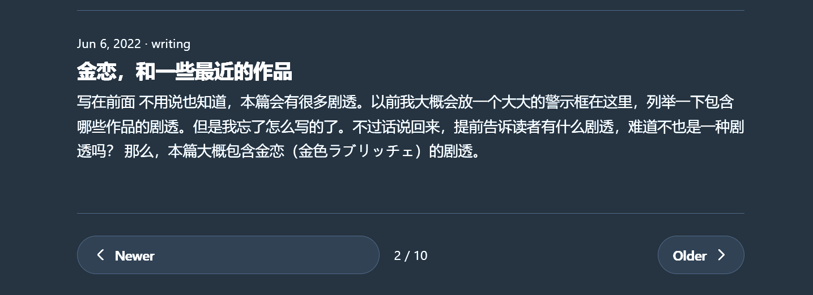
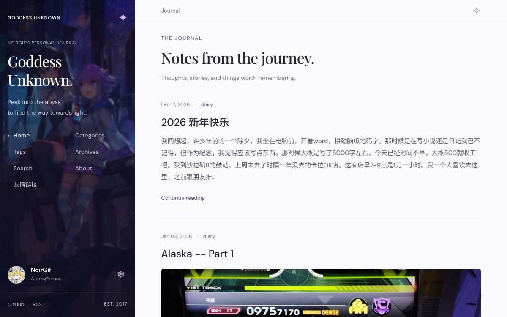

Typora 会奇妙地吞掉第一行的汉字，所以我只好从第二行开始写。

因为最近从网上看到，ChatGPT生成网页很厉害，有人说 ChatGPT site is highly underrated，于是突发奇想（也是quota用不完），让它照着这个网站，重新生成了一个。因为让这个网站加载的快点是我一直想做的，于是有了下面的prompt。

```
@Sites Make me a @Sites that reimagine [https://nir.moe](https://nir.moe) but eliminate transitions between subpages. That  is, if you click on a link the site should:

1. make the content being replaced disappear
2. rewrite the URL
3. load the new content
4. transition into the new content as they loads
5. images should be rendered from blurred to clearer (probably jpeg xl)
```

生成完了之后发现，这个玩意是host在openAI网站上的，我动不了，于是[让它提供了一个可部署的版本](https://chatgpt.com/share/6ac465d4-7f48-83e8-a813-eff4c08795ae)。用的是 GPT-6.1-Sol medium.

而这，是一切苦难的源头。




当然，我当时也是没有一个明确要做成个什么样，甚至忘了这个网站是部署在 cloudflare pages 上的，所以中间来来回回了很多次。也是最后的失败的一个重要因素，我觉得。另外一个因素，就是没在一开始给它提供博客的github，于是 chatgpt 选择了自己手搓一个渲染。



首先我就发现，点进一篇文章之后，侧边栏不缩回去。原来的博客，如果有人记得的话（我不记得了，还是看历史部署），是会缩回去的。然后用手机打开，顶栏直接占了一半的页面了。打回去。



这下好了，读文章的时候，用于回到主页的顶栏也没了。打回重造。






干净是干净了，不是让你啥都不留…… 顶上这个 breadcrumb 有必要吗，这又不是迷宫…… （实际是有必要的，靠这个回到主页，但是看不出来）。

而且整完一看 cloudflare speed，63分，甚至比原来还低。



让 6.1-sol medium 集中精力折腾了一番，

其中先是把cloudflare的意见发给GPT，后来直接让它去拉pagespeed结果了。

结果也算还行，花了$6左右，把图片加载、字体等等都整了一通。GPT最后搞出来一个静态加载第一页，然后动态加载后面页面的脚本，pagespeed 也是整到将近满分了。可惜的是还是有大的小的问题。这时候我在试用 Luna 去修这些小问题。


首先就是把这个不明所以的顶栏给换掉……我也另外让它加了一些小修改，例如添加了 Bangumi 链接之类的。


一个让我头疼的就是雪花脚本。原来是作为一个隐藏的彩蛋存在于原网站的。原设计是这样的：

1. 第一次点雪花，正常下雪
2. 第二次及以后雪花渐渐变大，变红
3. 整个屏幕突然变红，播放某首Grievous Lady中的笑声，然后清空整个网页（body 置空）。只能靠刷新重新加载网页。

真的是十分痛苦，AI貌似听不懂我说的，第一次点击，就让雪花以及整个屏幕染红了。

而且还把按键的雪花也变大了，随着按键次数增加，还会把整个div托起来，我真的是会谢。


另外，这个静态动态结合也带给了我点小麻烦。

### 动态页和静态页的结构不一致



我当时选择了打鼹鼠的方式，发现一次就让Luna修一次。


——我后来问，这个实现不需要SSR吗，AI说不用，PJAX+History API就能做到，只是原来的主题没做到。也算是学到了。


十月三日的晚上，在买完羽毛球拍，回家的路上，我痛定思痛，决定下单Claude。Opus 5.5 medium的第一个活，就是把GPT那套全丢了，重新重写一遍整个框架。这次我也学乖了，把所有的目标都告诉他了（还加了个夜间模式）。

```
Reimagine the old nir.moe (master branch, demo available at https://319c4603.nir-moe.pages.dev/, current https://nir.moe/ is of branch import/goddess-unknown-static, another remake that does not exactly align with the older one)
Your goal:

* matching aesthetics: aligned color theme for the whole page
* matched functionality: keep the snow flake script, but make snowflakes look better, and subsequent clicks more noticeable; keep the search and giscus functionality
* better UX: search highlighting the match, post page should focus on the post itself
* seamless: smooth transitions between page clicks, no whole-page reloads
* ease-to-manage: still preserve the easiness of hexo for creating a post/draft, optimizations are transparent to the manager
* performant: pagespeed gives no actionable advice (use env variable PAGESPEED_API_KEY to call pagespeed api)
* support night mode, but let operating system decide which to use
* Push and create a PR, to monitor its build and deployment

Stop when:

* PR created, and the cloudflare-deployed service passed pagespeed test, or
* You are going to do breaking change outside the new branch. Or there are blocking errors that you cannot explain or handle.

Cloudflare pages info:
Git repository: noirgif/blog
Build configuration
Build command:
bun install --frozen-lockfile && bun run build:cloudflare
Build output:
dist
Root directory:
Build comments:
Enabled
Branch control
Production branch:
import/goddess-unknown-static
Automatic deployments:
Enabled
Build watch paths
Include paths:
*
Build system version
Version 3
Deploy Hooks
No deploy hooks defined
Variables and secrets
Define the text, secret or build variables for your project
Type
Name
Value
Actions
Type
plain_text
Name
BUN_VERSION
Value
1.4.2
Type
plain_text
Name
NODE_VERSION
Value
24.15.0
Type
plain_text
Name
SITE_URL
Value
https://nir.moe
Type
plain_text
Name
SKIP_DEPENDENCY_INSTALL
Value
1
```

中途我想起来了提醒了一下，如果有UX改善，就改。就没做任何prompt。

结果就是你现在看到的 nir.moe 。用了3000多行代码。仍然沿用hexo，只是主题用PJAX。

Claude也不是没犯错误：newer 按键拉长占满了整个div，而 older 按键，加了个 `justify-self: start` 解决了。



以及我正文是用的宋体，它给改成了 sans，现在整回去了。

除了夜间模式（Windows 用户请用 Powertoys > System Tools > Light Switch），HiDPI 下的字体也调大了。4K屏100%缩放看这个对我的老花眼来说还是太煎熬了。

如果说丢失了什么，大概就是雪花脚本现在不会清空整个网页了。而且 prog®amer 变成了 prog@amer，谜。反正这个我也想改掉了。

最后为了写文章用，我让 sol-6.1 high 去给我提的反馈截屏举证，结果只截了logo的变化流程。打回去重做。

## 感想

GPT的设计有些地方还是有点意思的。标题的字体挺有风味。选择了淡紫色作为强调色，，整了一个 Gemini 一样的四角星 logo，这点我很喜欢，毕竟主题是海王星。

但是我在使用 GPT 6.1-Sol 也暴露出来一些问题：没有理解用户的意图，没有大局观，没有品味。



这个是sol给的初版，没用的UI太多了，跟网游似的。光 Journal 一个词就出现了3次，还有个 journey，stories。Thoughts, stories and things 也是GPT擅长的没有意义的三联列举。

经济上来说 GPT 6.1-Sol 确实比 Opus 5.5 便宜几倍。但是有的时候实际的使用成本，和benchmark的百分比是非线性相关的。

因为和benchmark不同，工程有的时候更偏向艺术。而艺术的成功失败条件是难以定义的。一个失败有时候不是说模型抛锚了，告诉你这个做不来；而是给了你一个大的方向上成功了的结果，这个结果里有很多的小失败，而这些失败是用户一开始 prompt 里没有提到的。用户需要去花时间和精力，去填补这些小失败。

当然再怎么痛苦，也比手搓要快就是了。
