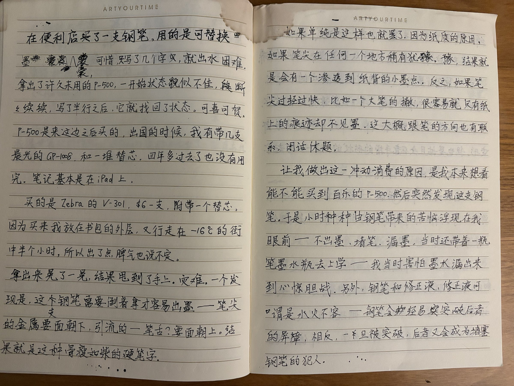
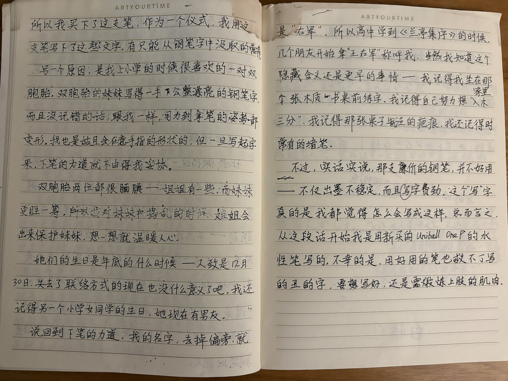
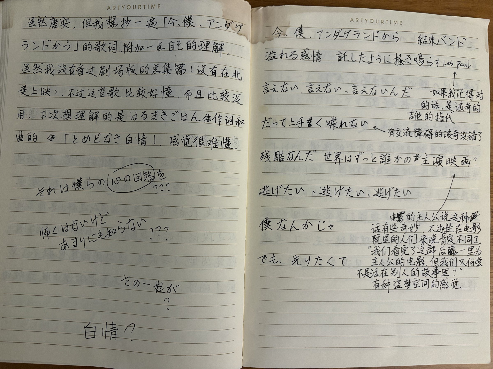
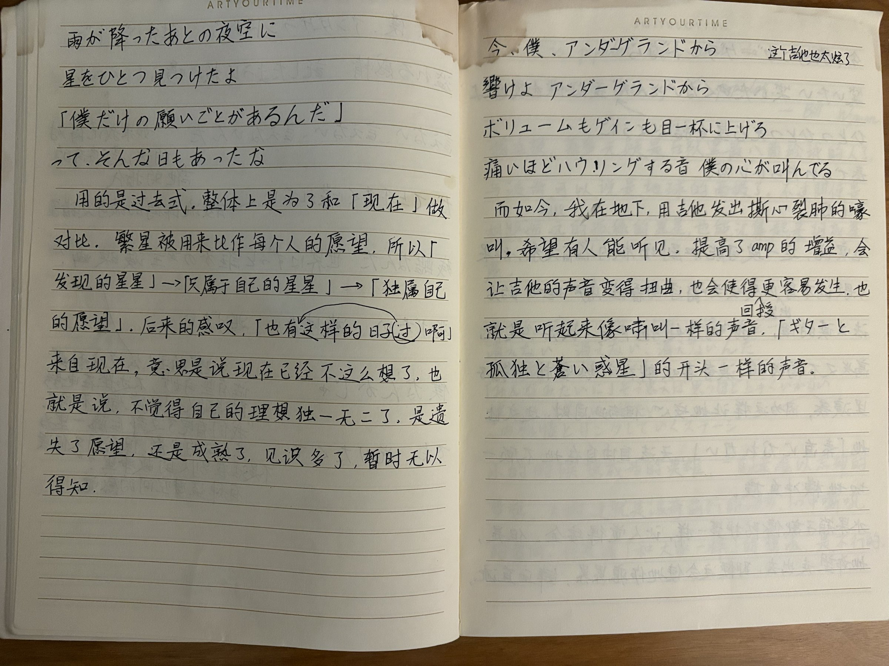
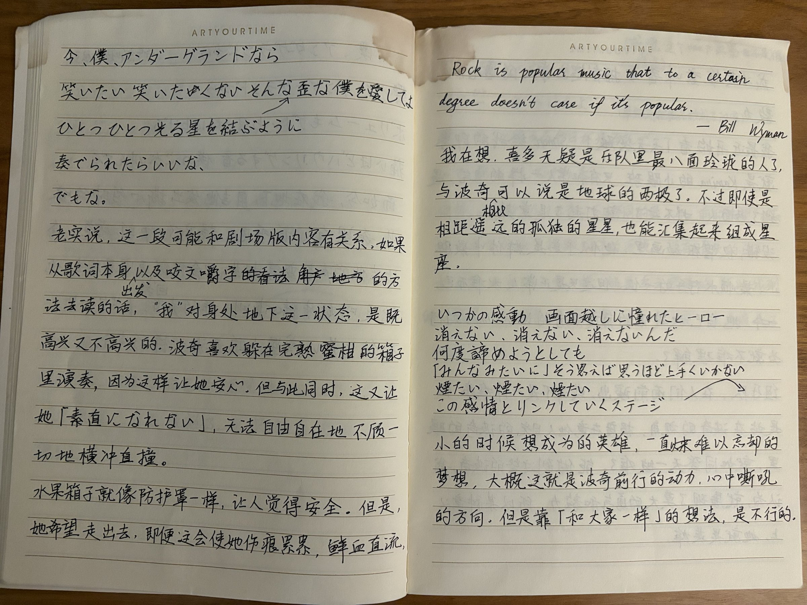
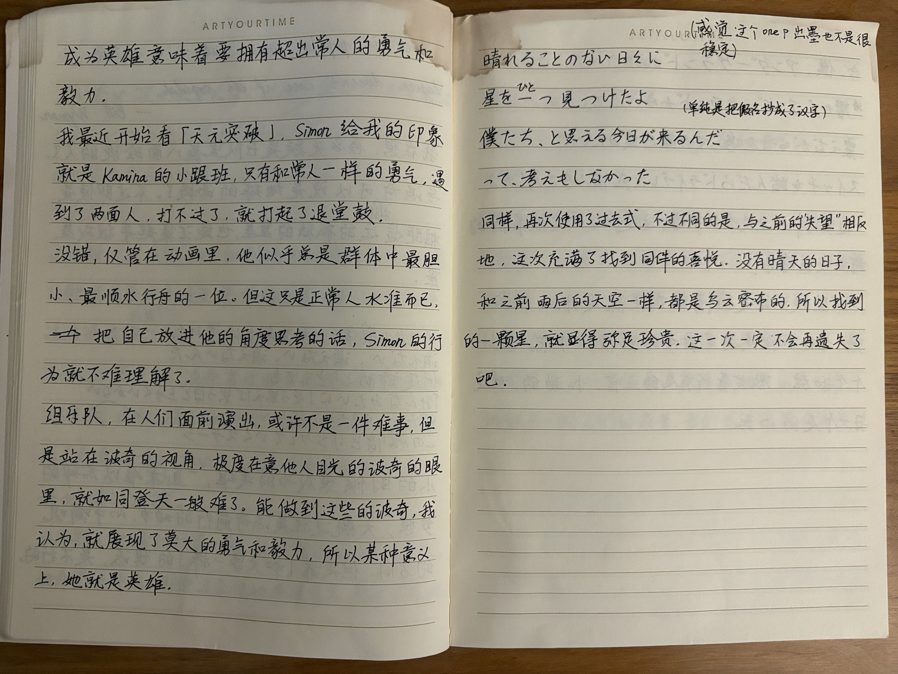
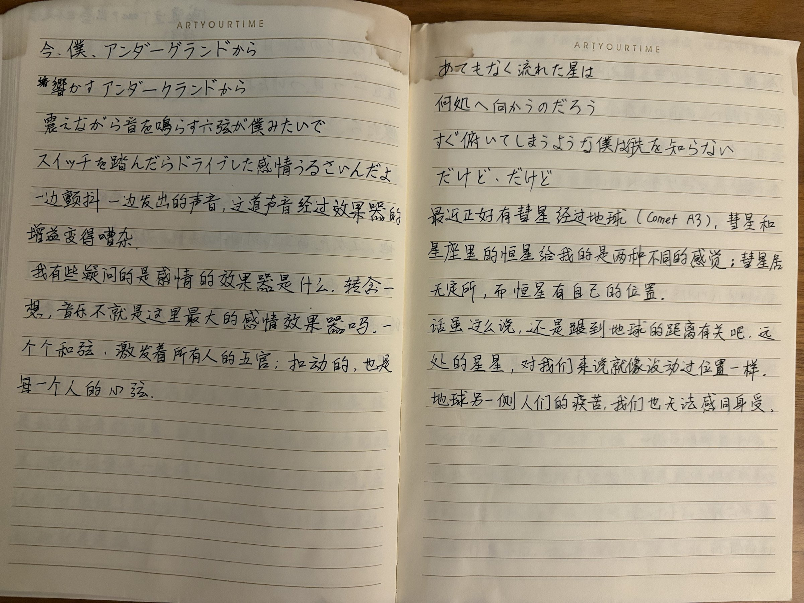
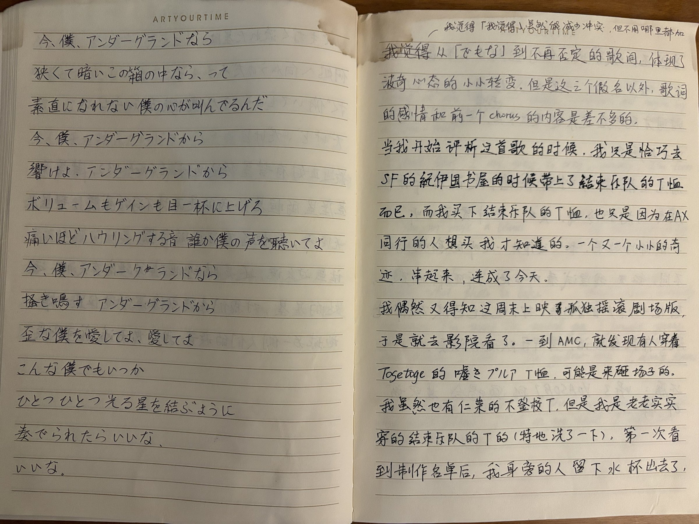
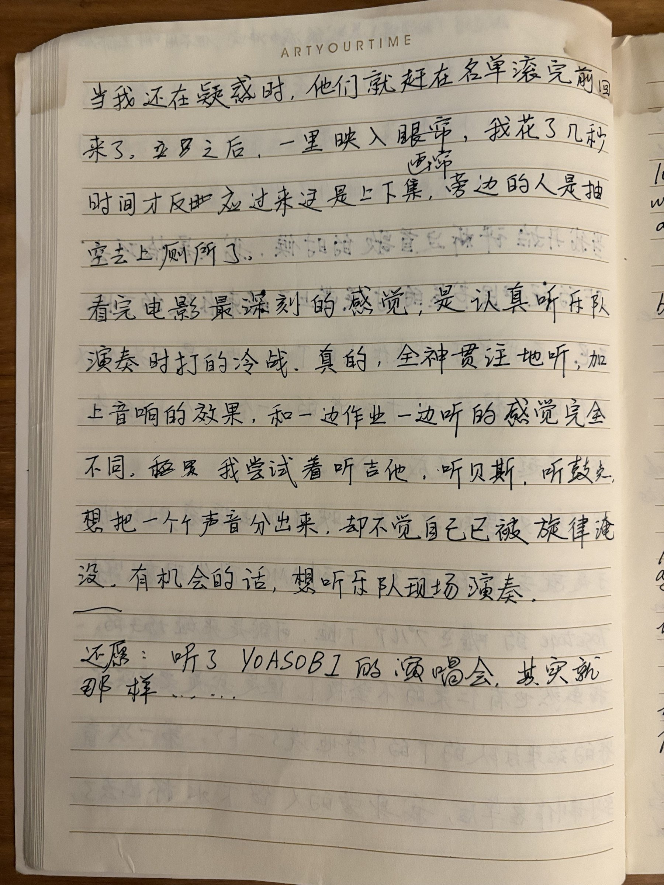


本文誊抄自一本手写的笔记本，原稿照片附在文末。删去的字照删，插入的字照插；写在页边的批注用灰色虚线标出。


在便利店买了一支钢笔，用的是可替换墨囊，可惜，只写了几个字，就出水困难。

拿出了许久未用的P-500，一开始状态貌似不佳，断断续续，写了半行之后，它就找回了状态。可喜可贺。

P-500是来这边之后买的，出国的时候，我有带几支晨光的GP-1008，和一堆替芯。四年多过去了也没有用完。笔记基本是在iPad上。

买的是Zebra的V-301，$6一支，附带一个替芯。因为买来我放在书包的外层，又行走在-16℃的街中半个小时，所以出了点脾气也说不定。

拿出来晃了一晃，结果甩到了手上。灾难。一个发现是，这支钢笔需要倒着拿才容易出墨——笔尖的金属要面朝下，引流的——笔舌？要面朝上。结果就是这种骨瘦如柴的硬笔字。

如果单纯是这样也就罢了。因为纸质的原因，如果笔尖在任何一个地方稍有犹豫，结果就是会有一个渗透到纸背的小墨点。反之，如果笔尖过轻过快，比如一个大笔的撇，很容易就只有纸上的痕迹却不见墨。这大概跟笔的方向也有联系。闲话休题。

让我做出这一冲动消费的原因，是我本来想看能不能买到百乐的P-500。然后突然发现这支钢笔。于是小时种种由钢笔带来的苦恼浮现在我眼前——不出墨、堵笔、漏墨，当时还带着一瓶钢笔墨水去上学——我当时害怕墨水漏出来到心惊胆战。另外，钢笔和修正液，修正液可谓是水火不容——钢笔会轻易突破后者的屏障，相反，一旦被突破，后者又会成为堵塞钢笔的犯人。

所以我买下了这支笔，作为一个仪式，我用这支笔写下了这些文字。有只能从钢笔字中汲取的营养。

另一个原因，是我上小学的时候很喜欢的一对双胞胎。双胞胎的妹妹写得一手工整漂亮的钢笔字，而且没记错的话，跟我一样，用力到拿笔的姿势都变形。我也是姑且会在意手指的形状的，但一旦写起字来，下笔的力道就不由得我妥协。

双胞胎两位都很腼腆——姐姐有一些，而妹妹更胜一筹。所以我对妹妹捣乱的时候，姐姐会出来保护妹妹。想一想就温暖人心。

她们的生日是年底的什么时候——大致是12月30日。失去了联络方式的现在也没什么意义了吧。我还记得另一个小学女同学的生日，她现在有男友。

说回到下笔的力道。我的名字，去掉偏旁，就是“右军”。所以高中学到《兰亭集序》的时候，几个朋友开始拿“王右军”称呼我。当然我知道这个隐藏含义还是更早的事情——我记得我坐在家里那张木质书桌前练字。我记得自己努力想“入木三分”。我记得那张桌子坑洼的疤痕。我还记得时常有的堵笔。

不过，实话实说，那支廉价的钢笔，并不好用——不仅出墨不稳定，而且写字费劲。这个“写”字真的是我都觉得怎么会写成这样。总而言之，从这段话开始我是用新买的Uniball One P的水性笔写的。不幸的是，用好用的笔也救不了写的丑的字，要想写好，还是需锻炼上肢的肌肉。

虽然唐突，但我想抄一遍「今、僕、アンダーグラウンドから」的歌词，附加一点自己的理解。

虽然我没有看过剧场版的总集篇（没有在北美上映），不过这首歌比较好懂，而且比较泛用。下次想理解的是はるまきごはん作词和曲的「とめどなき白情」，感觉很难懂。

> それは僕らの心の回路を？？？ 
> 怖くはないけど　あまりにも知らない？？？ 
> その一粒が？ 
> 白情？

## 今、僕、アンダーグラウンドから <small>結束バンド</small>


溢れる感情　託したように掻き鳴らす Les Paul
---

如果我记得对的话，是波奇的吉他的指代

===
言えない、言えない、言えないんだ
だって上手く喋れない
---

有交流障碍的波奇没错了

===
残酷なんだ　世界はずっと誰かの主演映画？
---

电影的主人公说这种话有些奇妙，不过在电影院里的人们来说肯定不同了。“我们看完了这部后藤一里为主人公的电影，但我们又何尝不是活在别人的故事里？”有种盗梦空间的感觉

===
逃げたい、逃げたい、逃げたい
僕なんかじゃ
でも、光りたくて
===
雨が降ったあとの夜空に
星をひとつ見つけたよ
「僕だけの願いごとがあるんだ」
って、そんな日もあったな
---
用的是过去式，整体上是为了和「现在」做对比。繁星被用来比作每个人的愿望，所以「发现的星星」→「只属于自己的星星」→「独属自己的愿望」。后来的感叹，「也有过这样的日子啊」来自现在，意思是说现在已经不这么想了，也就是说，不觉得自己的理想独一无二了。是遗失了愿望，还是成熟了，见识多了，暂时无以得知。
===
今、僕、アンダーグラウンドから
---

这个吉他也太炫了

===
響けよ　アンダーグラウンドから
ボリュームもゲインも目一杯に上げろ
痛いほどハウリングする音　僕の心が叫んでる
---
而如今，我在地下，用吉他发出撕心裂肺的嚎叫，希望有人能听见。提高了amp的增益，会让吉他的声音变得扭曲，也会使得回授更容易发生，也就是听起来像啸叫一样的声音，「ギターと孤独と蒼い惑星」的开头一样的声音。
===
今、僕、アンダーグラウンドなら
笑いたい　笑いたくない　そんな歪な僕を愛してよ
ひとつひとつ光る星を結ぶように
奏でられたらいいな、
でもな。
---
老实说，这一段可能和剧场版内容有关系。如果从歌词本身出发以及咬文嚼字的方法去读的话，“我”对身处地下这一状态，是既高兴又不高兴的。波奇喜欢躲在完熟蜜柑的箱子里演奏，因为这样让她安心。但与此同时，这又让她「素直になれない」，无法自由自在地不顾一切地横冲直撞。

水果箱子就像防护罩一样，让人觉得安全。但是，她希望走出去，即便这会使她伤痕累累，鲜血直流，


> Rock is popular music that to a certain degree doesn't care if it's popular.
>
> <footer>— Bill Wyman</footer>

我在想，喜多无疑是乐队里最八面玲珑的人了，与波奇相比可以说是地球的两极了。不过即使是相距遥远的孤独的星星，也能汇集起来组成星座。


いつかの感動　画面越しに憧れたヒーロー
消えない、消えない、消えないんだ
何度諦めようとしても
「みんなみたいに」そう思えば思うほど上手くいかない
煙たい、煙たい、煙たい
この感情とリンクしていくステージ
---
小时候想成为的英雄，一直难以忘却的梦想，大概这就是波奇前行的动力，心中嘶吼的方向。但是靠「和大家一样」的想法，是不行的。

成为英雄意味着要拥有超出常人的勇气和毅力。


我最近开始看「天元突破」，Simon给我的印象就是Kamina的小跟班，只有和常人一样的勇气，遇到了两面人，打不过了，就打起了退堂鼓。

没错，尽管在动画里，他似乎总是群体中最胆小、最顺水行舟的一位。但这只是正常人水准而已。把自己放进他的角度思考的话，Simon的行为就不难理解了。

组乐队，在人们面前演出，或许不是一件难事，但是站在波奇的视角，极度在意他人目光的波奇的眼里，就如同登天一般难了。能做到这些的波奇，我认为，就展现了莫大的勇气和毅力，所以某种意义上，她就是英雄。


晴れることのない日々に
星を<ruby>一<rt>ひと</rt></ruby>つ見つけたよ
僕たち、と思える今日が来るんだ
って、考えもしなかった
---

（感觉这个one p出墨也不是很稳定）

（单纯是把假名抄成了汉字）

同样，再次使用了过去式，不过不同的是，与之前的“失望”相反地，这次充满了找到同伴的喜悦。没有晴天的日子，和之前雨后的天空一样，都是乌云密布的，所以找到的一颗星，就显得弥足珍贵。这一次一定不会再遗失了吧。
===
今、僕、アンダーグラウンドから
響かすアンダーグラウンドから
震えながら音を鳴らす六弦が僕みたいで
スイッチを踏んだらドライブした感情うるさいんだよ
---
一边颤抖一边发出的声音，这道声音经过效果器的增益变得嘈杂。

我有些疑问的是感情的效果器是什么。转念一想，音乐不就是这里最大的感情效果器吗。一个个和弦，激发着所有人的五官；扣动的，也是每一个人的心弦。
===
あてもなく流れた星は
何処へ向かうのだろう
すぐ俯いてしまうような僕は行先を知らない
だけど、だけど
---
最近正好有彗星经过地球（Comet A3），彗星和星座里的恒星给我的是两种不同的感觉：彗星居无定所，而恒星有自己的位置。

话虽这么说，还是跟到地球的距离有关吧。远处的星星，对我们来说就像没动过位置一样。地球另一侧人们的疾苦，我们也无法感同身受。
===
今、僕、アンダーグラウンドなら
狭くて暗いこの箱の中なら、って
素直になれない僕の心が叫んでるんだ
今、僕、アンダーグラウンドから
響けよ、アンダーグラウンドから
ボリュームもゲインも目一杯に上げろ
痛いほどハウリングする音　誰か僕の声を聴いてよ
今、僕、アンダーグラウンドなら
掻き鳴らす　アンダーグラウンドから
歪な僕を愛してよ、愛してよ
こんな僕でもいつか
ひとつひとつ光る星を結ぶように
奏でられたらいいな、
いいな。
---

我觉得「我觉得」虽然能减少冲突，但不用哪里都加

~~我觉得~~从「でもな」到不再否定的歌词，体现了波奇心态的小小转变。但是这三个假名以外，歌词的感情和前一个chorus的内容是差不多的。


当我开始评析这首歌的时候，我只是恰巧去SF的纪伊国书屋的时候带上了结束乐队的T恤而已，而我买下结束乐队的T恤，也只是因为在AX同行的人想买我才知道的。一个又一个小小的奇迹，串起来，连成了今天。

我偶然又得知这周末上映孤独摇滚剧场版，于是就去影院看了。一到AMC，就发现有人穿着Togetoge的嘘つきプルア T恤，可能是来砸场子的。

我虽然也有仁菜的不登校T，但是我是老老实实穿的结束乐队的T的（特地洗了一下），第一次看到制作名单后，我身旁的人留下水杯出去了，当我还在疑惑时，他们就赶在名单滚完前回来了。之后，一里映入眼帘，我花了几秒时间才反应过来这是上下集，旁边的人是抽空去上厕所了。

看完电影最深刻的感觉，是认真听乐队演奏时打的冷战。真的，全神贯注地听，加上音响的效果，和一边作业一边听的感觉完全不同。我尝试着听吉他，听贝斯，听鼓点，想把一个个声音分出来，却不觉自己已被旋律淹没。有机会的话，想听乐队现场演奏。

---

还愿：听了YOASOBI的演唱会，其实就那样……

## 手稿

